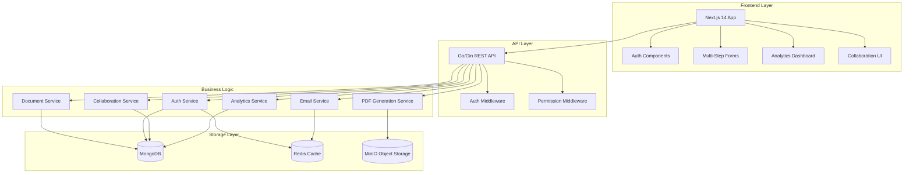
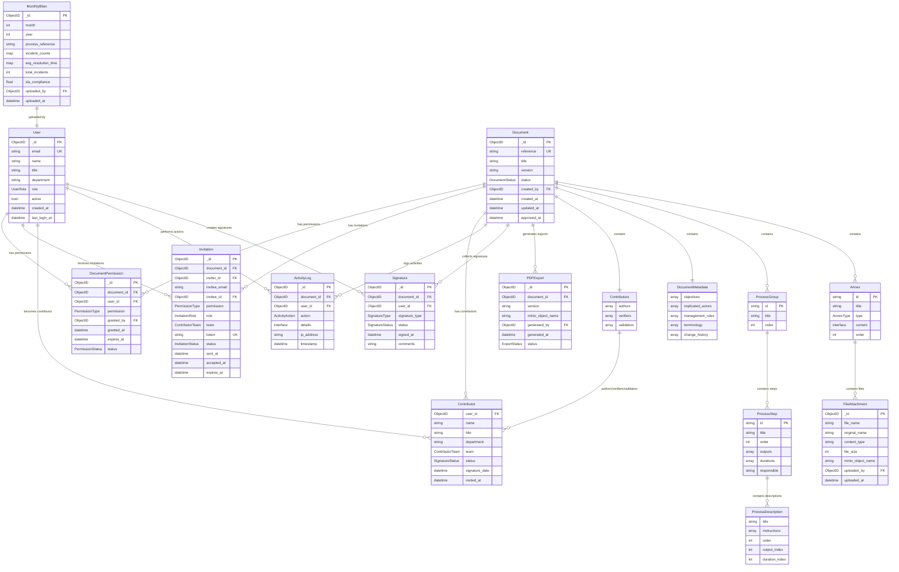
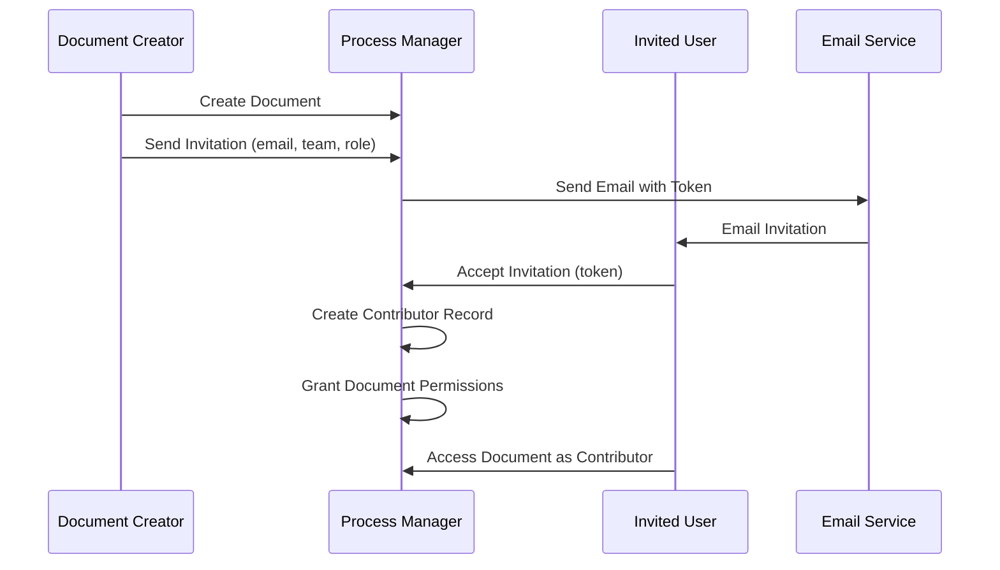
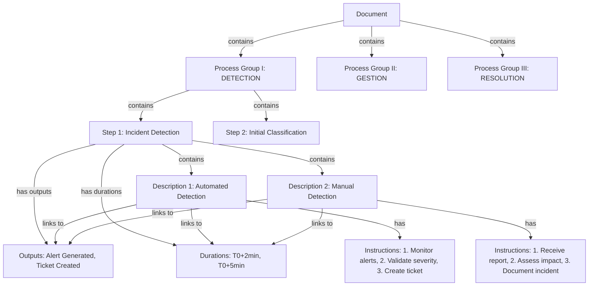
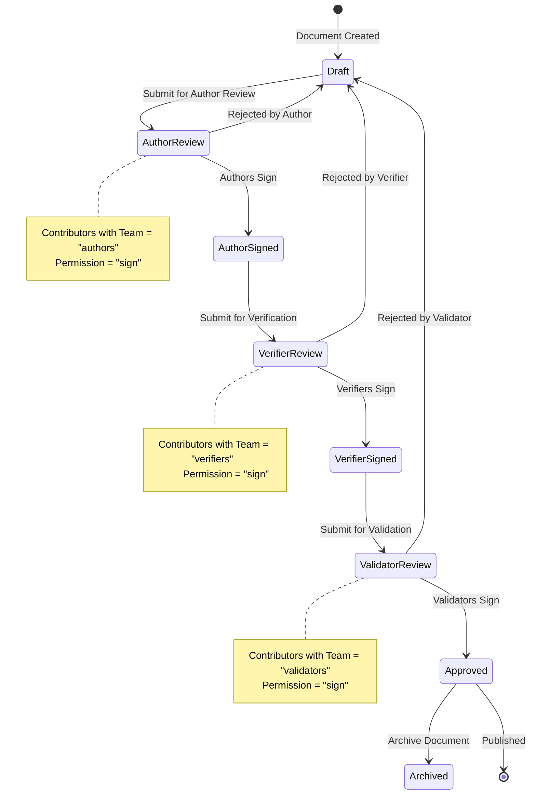
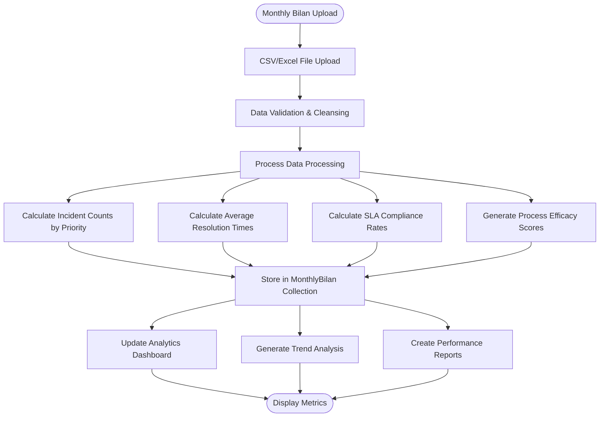
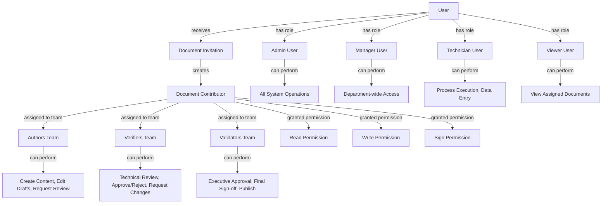
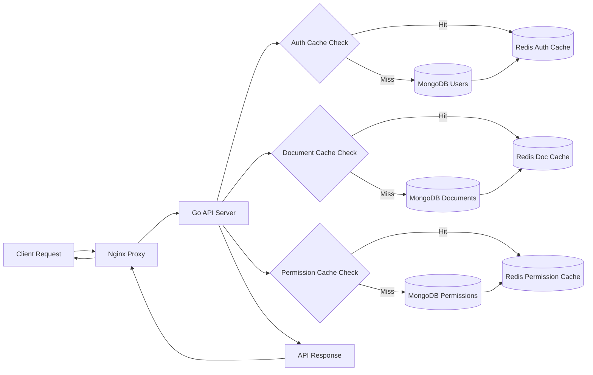

# Process Manager - Architecture & Data Model

## 🏗️ System Architecture



## 📊 Database Schema Relationships



## 🔄 Data Flow Diagrams

### User Invitation & Contributor Flow



### Process Definition Structure



### Three-Tier Signature Workflow



### Analytics Data Processing



## 🔐 Security & Permission Model

### Permission Matrix



## 📁 File Storage Architecture

```mermaid
graph TD
    MINIO[(MinIO Object Storage)] --> BUCKETS{Bucket Structure}
    
    BUCKETS --> TEMPLATES[process-documents/templates/]
    BUCKETS --> DOCS[process-documents/documents/]
    BUCKETS --> BILANS[process-documents/bilans/]
    
    TEMPLATES --> LOGO[yas-logo.png]
    TEMPLATES --> TEMPLATE[yas_template.html]
    
    DOCS --> DOC_FOLDER[{doc-id}/]
    DOC_FOLDER --> ATTACHMENTS[attachments/]
    DOC_FOLDER --> GENERATED[generated/]
    
    ATTACHMENTS --> DIAGRAMS[diagrams/]
    ATTACHMENTS --> UPLOADS[user-uploads/]
    
    GENERATED --> PDFS[exported-pdfs/]
    GENERATED --> VERSIONS[version-archives/]
    
    BILANS --> YEAR_FOLDER[{year}/]
    YEAR_FOLDER --> MONTH_FOLDER[{month}/]
    MONTH_FOLDER --> CSV_FILES[*.csv, *.xlsx]
```

## ⚡ Performance & Caching Strategy



---

**Generated with Claude Code** 🤖

Co-Authored-By: Claude <noreply@anthropic.com>